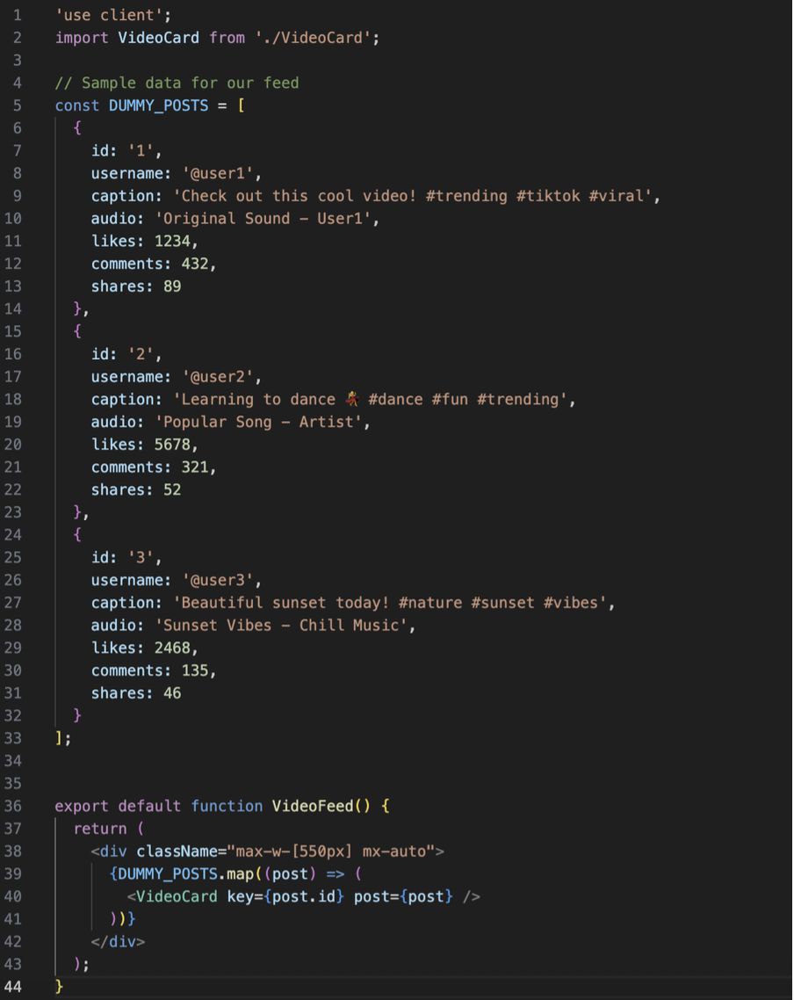

# Practical 1: TikTok Clone Interface using Next.js

## Overview
- This Project is about building a TikTok web interference by using Next.js with Tailwind CSS, and React Hook form. 
- It covers the layout structure, page routing, video feeds, user profiles, upload functionality and authentication forms.

## Features
- **Responsive Layout**: Sidebar navigation and main content area
- **Video Feed**: Displays video cards with like, comment, and share functionality
- **Authentication**: Login and signup forms with validation
- **Pages**:
  - Home (For You feed)
  - Following page
  - Explore page
  - LIVE page
  - Upload page
  - Profile page
  - Login/Signup page

## Technologies Used:

- Next.js (App Router)
- Tailwind CSS
- React Icons
- React Hook Form (for form validation)
- JavaScript (JSX)

## Installation:

## Project Setup:

## Part_1: Getting started

### Step 1: Navigate to Your Project Directory
- cd Practical1_TikTok

### Step 2: Create a New Next.js Project
- npx create-next-app@latest
**Configured the project with the following settings:**
- Would you like to use TypeScript? → No (We'll be using JSX)
- Would you like to use ESLint? → Yes
- Would you like to use Tailwind CSS? → Yes (We'll use this for styling)
- Would you like to use src/ directory? → Yes (For better organization)
- Would you like to use App Router? → Yes (We'll use the new App Router)
- Would you like to customize the default import alias? → No

### Step 3: Clean Up the Default Project
- Navigate to the src/app directory
- Replace the contents of page.js with a basic component:

- Clean up globals.css in the app directory to keep only the Tailwind directives:
@import "tailwindcss";
- Refer: Install Tailwind with Next.js

### Step 4: Set Up Project Structure
- **Create these folders to organize your project (inside the src directory):**
mkdir -p src/components/layout
mkdir -p src/components/ui
mkdir -p src/lib
mkdir -p src/app/profile
mkdir -p src/app/upload

### Step 5: Create Basic Layout Components
- Create a basic layout component in src/components/layout/MainLayout.jsx and also include
links:

### Step 6: Update layout.js in the App Directory
- Modify src/app/layout.js to include your layout:

### Step 7: Create Basic Pages for Navigation
- Create a profile page at src/app/profile/page.jsx:

- Create an upload page at src/app/upload/page.jsx:

### Step 8: Start the Development Server
- Your project should now be running at http://localhost:3000
- npm run dev(To run the project)

## Part_2: Creating the Web Layout and Main Interface

### Step 1: Install Additional Dependencies
- Install some useful packages for our interface:
- npm install react-icons

### Step 2: Update the Layout Structure
- restructure our layout to match TikTok's web version with a sidebar. Update
src/components/layout/MainLayout.jsx:

### Step 3: Create a For You Page Component
- Create a feed similar to TikTok's web version. Create a new file
src/components/ui/VideoCard.jsx:

### Step 4: Create a VideoFeed Component
- Create a new file src/components/ui/VideoFeed.jsx:

### Step 5: Update the Home Page
- Update our home page to display the video feed. Update src/app/page.js:

### Step 6: Create a Following Page
- Create a new file src/app/following/page.jsx:

### Step 7: Create an Explore Page
- Create a new file src/app/explore/page.jsx:

### Step 8: Create a Live Page
- Create a new file src/app/live/page.jsx:

### Step 9: Create an Upload Page
- Update our upload page to match TikTok's web interface. Update
src/app/upload/page.jsx:

### Step 10: Update the Profile Page
- Update src/app/profile/page.jsx:

### Step 11: Test Your Application
- Run your development server and test the application.

## Part_3: Creating Login and Registration Forms

### Step 1: Install Required Dependencies
- Install a package to help with form handling and validation:
- npm install react-hook-form

### Step 2: Create Login Page
- Create a new file at src/app/login/page.jsx:

### Step 3: Create Signup Page
- Create a new file at src/app/signup/page.jsx:

### Step 4: Update MainLayout Component
- Update the src/components/layout/MainLayout.jsx to include login and signup links:
**Change 1: Update the Login Button in the Sidebar**

**Change 2: Update the Header Login Button**

## Available Scripts
- **npm run dev:** Starts the development server
- **npm run build:** Builds the application for production
- **npm start:** Runs the built application in production mode
- **npm run lint:** Runs ESLint

## Additional Dependencies
- **react-icons:** For icon components
- **react-hook-form:** For form handling and validation

## Resources
- React Documentation
- Next.js Documentation
- React Hook Form
- Tailwind CSS

## License
- This project is open source and available under the MIT License.